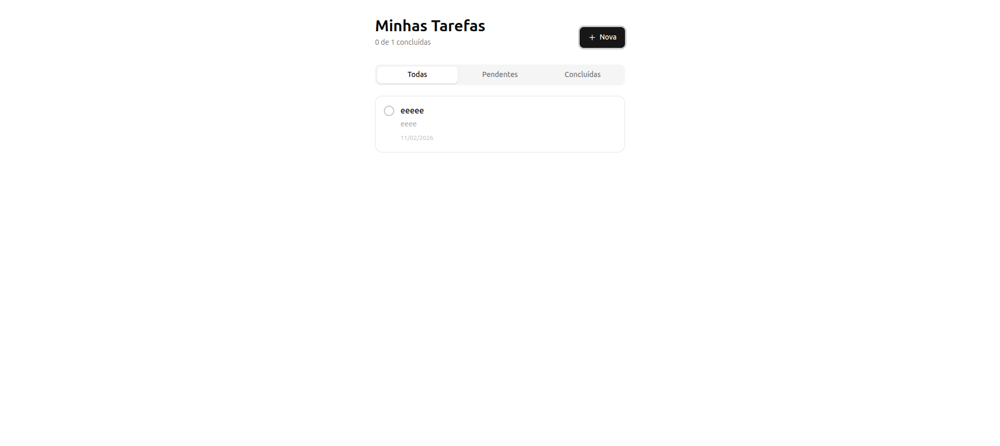
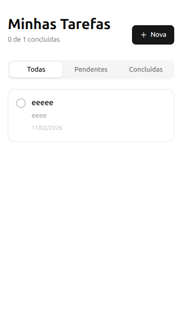
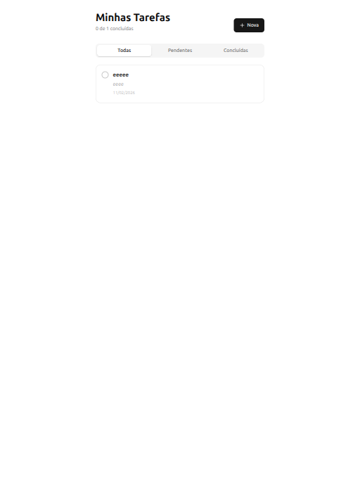

<h1 align="center">Task Application</h1>

<p align="center">
  Uma landing page moderna e responsiva para uma agência de viagens fictícia, focada em destinos europeus encantadores. Desenvolvida como projeto prático de HTML, CSS e JavaScript.
</p>

<p align="center">
  
  
  
  
  
  
</p>

### 📋 Sobre o Projeto
Task Application é uma aplicação web para gerenciamento de tarefas desenvolvida com React e TypeScript.

O projeto permite criar, editar, concluir e excluir tarefas com persistência local no navegador.

Foi desenvolvido com foco em:
- ✅ Arquitetura baseada em Context API

- ✅ Tipagem forte com TypeScript

- ✅ Componentização com shadcn/ui

- ✅ Persistência de dados com LocalStorage

### 🎯 Funcionalidades

- **Adicionar Tarefas**: Criação de novas tarefas com título e descrição opcional

- **Editar Tarefas**: Atualização de informações existentes

- **Excluir Tarefas**: Remoção com confirmação via AlertDialog

- **Marcar como Concluída**: Toggle de status com feedback visual

- **Filtro de Tarefas**:
  - Todas
  - Pendentes
  - Concluídas

- **Persistência Local**: Dados salvos automaticamente no LocalStorage

- **Estado Vazio Inteligente**: Mensagens diferentes para lista vazia e filtro sem resultados

- **Interface Responsiva**: Layout adaptável para diferentes tamanhos de tela

### 🧱 Arquitetura
- O projeto foi estruturado seguindo boas práticas de organização:

- Context API para gerenciamento global de tarefas

- Componentes reutilizáveis (TaskCard, TaskForm, etc.)

- Separação de responsabilidades

- Design tokens personalizados via Tailwind v4

- Sistema de variantes com shadcn/ui

### 🚀 Tecnologias Utilizadas

- **React** – Interface declarativa

- **TypeScript** – Tipagem estática e segurança

- **Vite** – Build tool moderna

- **Tailwind CSS v4** – Estilização utilitária

- **shadcn/ui** – Componentes acessíveis e reutilizáveis

- **Lucide React** – Ícones

- **React Router** – Navegação entre páginas

- **LocalStorage API** – Persistência de dados no navegador

### 💻 Como Executar

1. **Clone o repositório**
```bash
git clone https://github.com/henrymzs/task-application.git
```

2. **Acesse a pasta do projeto**
```bash
cd task-application
```

3. **Instale as dependências**
```bash
npm install ou bun install
```

4. **Execute o projeto**
```bash
npm run dev ou bun dev
```

5. **A aplicação estará disponível em:**
```bash
http://localhost:5173
```

### 📦 Persistência de Dados
As tarefas são armazenadas no navegador utilizando a **API localStorage**.

Os dados são salvos automaticamente a cada modificação e recuperados no carregamento da aplicação.

### 📱 Responsividade

O projeto é totalmente responsivo e foi testado nos seguintes breakpoints:

- **Mobile**: < 600px
- **Tablet**: 600px - 991px
- **Desktop**: ≥ 992px

### 📸 Screenshots

### Desktop


### Mobile


### Tablet



### 👤 Autor

**Henry**

- GitHub: [@henrymzs](https://github.com/henrymzs)
- LinkedIn: [henry-kaua](https://linkedin.com/in/henry-kaua/)
- Email: henrykaua21@gmail.com

⭐ **Se este projeto te ajudou, considere dar uma estrela!**